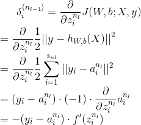
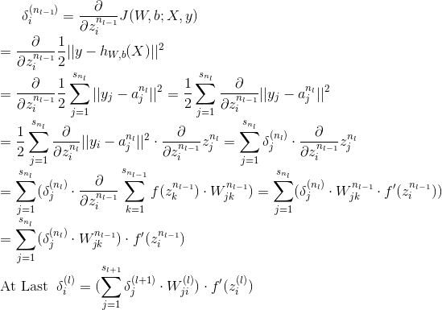

# BP神经网络(Back Propagation Neural Networks)
通常指的是具有三层网络结构的浅层神经网络

神经网络的实质就是每一层隐藏层的生成, 都生成了新的特征, 新的特征在此生成新的征, 直到最新的特征能够很好的表示该模型为止.
这样就解决了线性不可分或特征选取不足或不精确等问题的产生.(线性不可分的实质就是特征不够)

## BP神经网络详解

### 基础知识

神经网络是由一个个"神经元"的基本单元构成, 神经元结构由输入、计算单元和输出组成.
公式为: , 其中W表示的是权重向量, 
函数f为激活函数(通常为Sigmoid函数或者tanh双曲正切函数)

几种激活函数:
-  
Sigmoid(区间[0, 1]当输出为1时表示被激活): 
 
-  
tanh(区间[-1, 1]当输出为1时表示被激活): 
 
-  
ReLu: 
 
-  
SoftPlus: 
 

神经网络中主要的一些参数
- 网络的层数nL
- 网络权重和偏置(W, b)=(W(1), b(1), W(2), b(2)), 
其中Wij(L)表示的是第L层的第j个神经元和第L+1层的第i个神经元之间的连接参数, 
bi(L)标识的是第L+1层的第i个神经元的偏置项

### 优缺点

- 优点:
    - 具有很强的非线性映射能力和柔性的网络结构.
- 缺点:
    - 学习速度慢, 即使是简单的问题, 一般也需要几百上千次的学习才能收敛
    - 容易陷入局部极小值
    - 网络层数、神经元个数的选择没有相应的理论指导(靠经验)
    对于越复杂的的数据分布, 神经网络需要越强的能力去对这批数据建模, 因此需要越多的隐含层节点数.
    - 网络推广能力有限

## BP神经网络算法

损失函数: 
 
, 为了防止模型的过拟合, 在损失函数中会加入正则项
 

损失函数求解推导过程:
- 目标: 使求得参数W和参数b使得损失函数J(W, b)达到最小值
- 步骤
    - 对参数进行随机初始化, 即将参数初始化为一个很小的接近0的随机值
    - 利用前向传播(即通过输入及激活函数和各个网络层依次处理P118)得到预测值hW,b,
    进而得到损失函数, 计算误差, 此时利用梯度下降(SGD)的方法对参数进行调整, 公式如下:
     
, 其中α称为学习率, 在计算参数的更新公式中, 
    需要用到反向传播算法,
 
    所以Wij(l)和bi(l)的偏导数为:
    
    - 反向传播调整参数, 反向传播算法的思想
        - 对于给定的训练数据, 通过前向传播算法计算出每一个神经元的输出值, 当所有神经元的输出都计算完成后,
        对每一个神经元计算其"残差".
        - 什么是残差(残差可以表示该神经元对最终的残差产生的影响)
            - 第L层的神经元i的残差可以表示为δi(L)
            - 残差表示的是该神经元对最终的残差产生的影响
            - zi(L)表示第L层上的第i个神经元的输入加权和, 
            ai(L)表示的是第L层上的第i个神经元的输出, 
            即ai(L)=f(zi(L))
            - 分为两种情况: 输出神经元, 非输出神经元
                - 输出层残差公式:
                 

 
                - 非输出层, 即L=nl-1, nl-2,...残差公式:
                 

 
                
                    权重更新公式:
                     

 
                       
                       
BP神经网络中参数的设置
- 超参数
    - 无法通过梯度下降法得到
    - 属于非凸优化问题
    - 解决方案: 经验法则选择超参数

- 非线性变换
    - 常见的非线性函数
        - sigmoid函数, 函数输出均值不为0
        - tanh函数, 函数输出均值为0, 因此收敛性更好
 
- 学习率: 固定的学习率(较简单), 动态的学习率(如: )

- 隐含层节点的个数: 对于越复杂的数据分布, 神经网络更多的隐含层节点个数去帮助建模

## 杂谈
- [BP算法推导较好的一篇文章](https://www.cnblogs.com/biaoyu/p/4591304.html)
- [通俗易懂的神经网络文章](https://blog.csdn.net/u014403897/article/details/46347351)
- [为什么反向](https://www.zhihu.com/question/27239198/answer/89853077)其中的图解很不错, 比较详细的解释了反向传播
(BP算法避免了计算冗余, 对于每一个路径只访问一次就能求顶点对所有下层节点的偏导值)
- [BP图例及详解](https://blog.csdn.net/leiting_imecas/article/details/60463897)

## [着重看这篇](http://galaxy.agh.edu.pl/~vlsi/AI/backp_t_en/backprop.html)